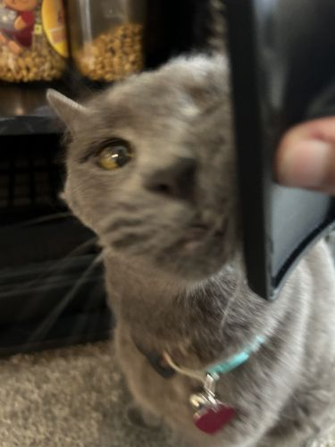
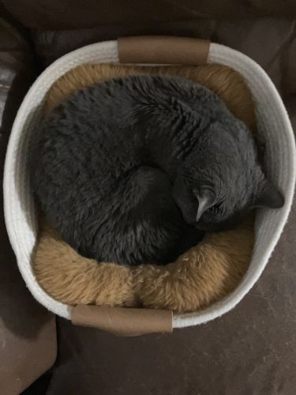
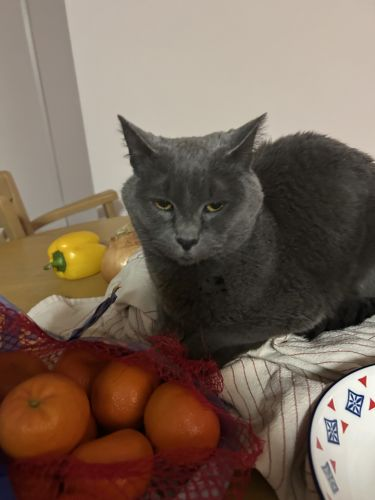
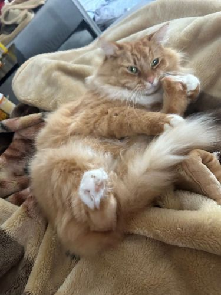
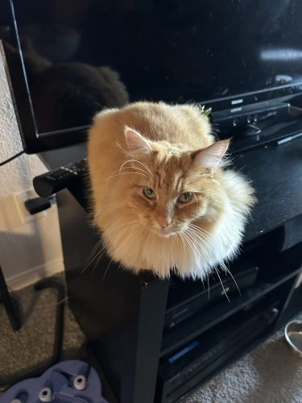
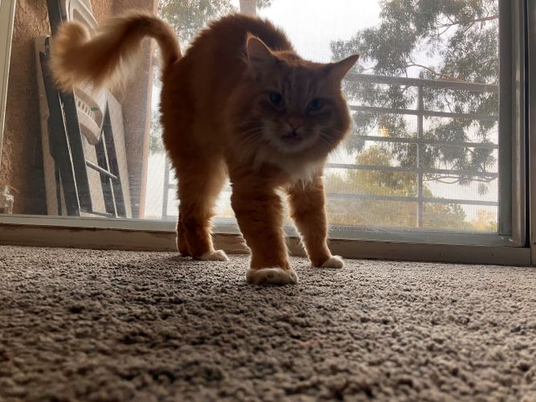

# Jonathan Renteria
## About Me
### Overview

Heyo, I'm a 2nd year Computer Engineering major at UC San Diego.

An important fact about me is that I have 2 cats!
1. **Sasha** - Short-haired russian blue\




1. **Muffin** - Long-haired orange tabby\




### Hobbies
I like to make video games in my spare time. In fact, I'm an officer at UC San Diego's [Video Game Development Club](https://www.vgdc.dev/)!

I also play all sorts of video games, recently I've gotten into retro sci-fi games, try to guess the following quotes below!

> "Hate. Let me tell you how much I've come to hate you since I began to live.
> 
> There are 387.44 million miles of printed circuits in wafer thin layers that fill my complex. If the word 'hate' was engraved on each nanoangstrom of those hundreds of millions of miles it would not equal one one-billionth of the hate I feel for humans at this micro-instant.
> 
> For you. Hate. Hate."

Okay that one was a bit easy, how about this one?

> "I... don't think that I can continue. Continue?
> 
> To have done the things I have done in the name of progress and healing.
> 
> It was madness. I can see that now. Madness. Madness?
> 
> There is no hope. Leave now, leave while you still have... Hope."

Alright, just one more!

> But you were dead a thousand times. Hopeless encounters successfully won, a man long dead, grafted to machines your builders did not understand. You follow the path, fitting into an infinite pattern.
>
> Yours to manipulate, to Destroy, and rebuild.
> 
> "Now, in the quantum moment before the closure, when all become one, one moment left, one point of space and time.
>
> I know who you are.
>
> You are destiny."

### Academics

This quarter, I'm taking the following courses:

-  CSE 110
-  CSE 141
-  CSE 141L
-  CSE 168

Also, here's a code snippet I found humorous.

```
'use strict';

var isOdd = require('is-odd');

module.exports = function isEven(i) {
    return !isOdd(i);
}
```

If you want some information about this project, check out this project's [README](README.md) file.

And, I suppose, here's my daily to-do list:

- [ ] Wake up
- [ ] Say "ahh, so eepy"
- [ ] Go back to sleep
- [ ] Repeat

[Return to top!](#jonathan-renteria)